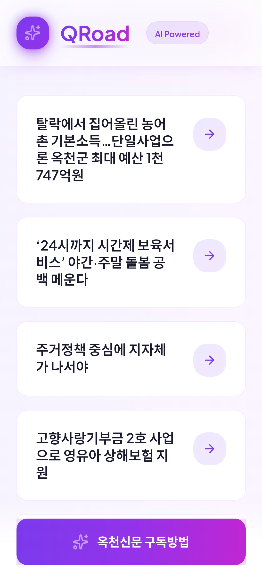
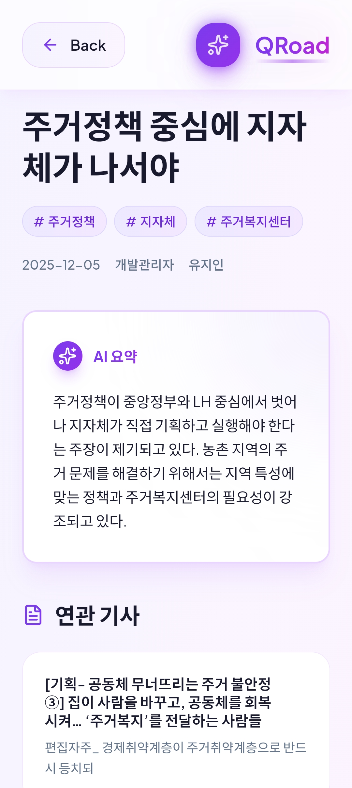
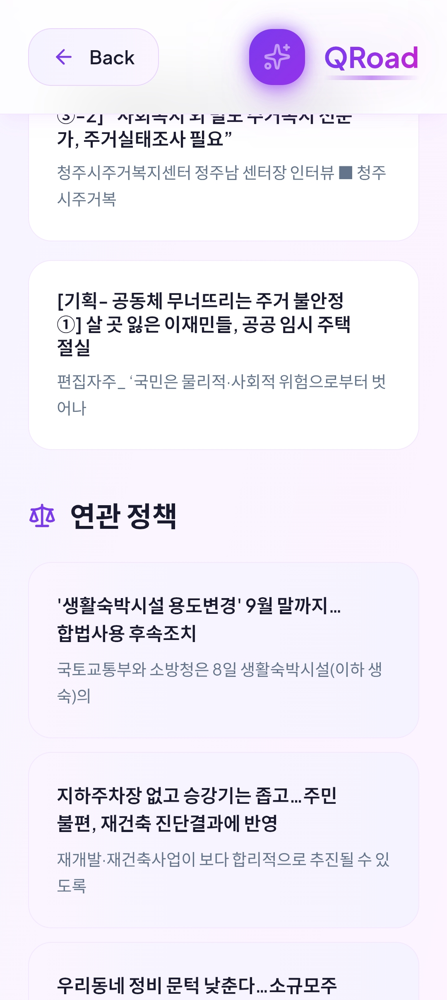

# QRoad – QR 기반 지역신문 기사 확장 정보 서비스

지역신문 기사에 QR 코드를 삽입하여, 독자가 스캔만 하면  
해당 기사와 연관된 **과거 기사 · 정책 정보 · AI 요약**을 즉시 확인할 수 있는 서비스입니다.  
종이신문의 한계를 보완하고 지역 언론의 정보 접근성을 높이기 위해 개발되었습니다.

---

## 📚 프로젝트 개요

- **프로젝트명:** QRoad  
- **목표:** 지역신문의 정보 부족 문제를 해소하고 독자의 정보 접근성을 높이는 QR 기반 확장 정보 제공 서비스 구축  
- **핵심 기능:**  
  - QR 스캔 → 기사 리스트 및 상세 페이지 이동  
  - 기사 AI 요약 제공  
  - 연관 기사 추천  
  - 정책 정보 자동 매칭  
  - 관리자 페이지를 통한 기사 등록 및 QR 생성

---

## 📁 Repositories

본 프로젝트는 **Frontend / Backend**로 구성되어 있습니다.  

- 🔵 **Frontend Repository**  
  https://github.com/kakao-techforimpact-qroad/FE

- 🟡 **Backend Repository**  
  https://github.com/kakao-techforimpact-qroad/BE

---

## 🧩 시스템 아키텍처

본 서비스는 QR 스캔을 통해 사용자에게 기사 확장 정보를 제공하는 구조로,  
프론트엔드–백엔드–AI/데이터베이스가 연동되는 흐름으로 동작합니다.

### 전체 구조 요약
1. 사용자가 신문 지면의 QR을 스캔  
2. 프론트엔드(React)로 접속하여 기사 리스트 또는 상세 페이지 조회  
3. 백엔드(Spring Boot)가 기사·정책·연관 기사 추천 정보를 제공  
4. AI 요약은 OpenAI API를 통해 생성  
5. 유사도 검색은 OpenAI Embeddings → PostgreSQL(pgvector) 기반으로 처리  

### 텍스트 아키텍처
```
[User QR Scan]
        ↓
[Frontend (React)]
        ↓ API
[Backend (Spring Boot)]
        ├─ PostgreSQL (기사/정책/메타 데이터)
        ├─ pgvector (유사도 검색)
        └─ OpenAI API (AI 요약)
```

---

## 🚀 주요 기능

### 🔍 QR 랜딩 페이지
- QR 스캔 시 해당 신문 호수의 기사 목록 표시  
- 모바일 최적화 UI

### 📝 상세 기사 페이지
- 기사 본문 전체 제공  
- AI 요약  
- 연관 기사 추천  
- 정책 정보 매칭  

### 🛠 관리자 페이지
- 기사 등록 및 관리  
- QR 코드 자동 생성  
- AI 요약 검토 및 수정  

---

## 🖼️ 시연 화면 (Screenshots)

아래는 실제 동작 중인 QRoad 서비스의 주요 화면입니다.

---

### 1) 관리자 페이지 – 기사 목록 관리
관리자가 발행된 기사를 확인하고 상세 정보/수정 작업을 할 수 있습니다.

<p align="center">
  
</p>

---

### 2) QR 랜딩 페이지 – QR 스캔 후 기사 리스트 표시
사용자가 신문 지면의 QR을 스캔하면 해당 호수의 모든 기사가 표시됩니다.

<p align="center">
  
</p>

---

### 3) 기사 상세 페이지 – AI 요약 및 연관 기사 제공
기사의 전체 본문, AI 요약, 연관 기사 추천을 한눈에 볼 수 있는 모바일 화면입니다.

<p align="center" margin="5px">
  
  
  
</p>

---

## 🧪 기술 스택

### **Frontend**
- React, Vite, Tailwind CSS

### **Backend**
- Java, Spring Boot, JPA  
- PostgreSQL, pgvector  

### **AI / LLM**
- OpenAI GPT-4o-mini (기사 요약)  
- OpenAI Embeddings (텍스트 벡터화)

### **Infra**
- AWS EC2  
- Nginx  
- GitHub Actions (CI/CD)

---

## 🎥 시연 자료

- **시연 영상 (Google Drive)**  
  https://drive.google.com/drive/folders/1leGrZXGrTPNzPMT5NybKs4aXGpVDzir4?usp=sharing

- **발표 자료 PDF**  
  https://drive.google.com/file/d/11TZWxXLR1JnW3uvhpOeSkoHDS5QtdRUA/view?usp=sharing

---

## 📆 개발 기간
- 2024.10 ~ 2024.12

---

## 👥 팀 구성

| 역할 | 이름 | 전공 |
|------|------|------|
| 김성규 | PM/팀장 | 행정학과 |
| 김종수 | Frontend | 컴퓨터공학과 |
| 문진영 | Backend/AI | 컴퓨터공학과 |
| 조예지 | Backend/Infra | 컴퓨터공학과 |
| 김유신 | Backend/크롤링 | 인공지능학과(소프트웨어전공) |

---

## 🧠 프로젝트 회고

- QR 기반 흐름을 실제 서비스로 구현하며 **오프라인 정보를 온라인으로 확장하는 구조**를 이해할 수 있었습니다.  
- AI 요약 정확도 개선, 데이터 정제 등 기술적 도전이 있었지만 협업을 통해 해결하며 많은 성장을 경험했습니다.  
- 실제 지역신문 문제를 기반으로 진행한 프로젝트여서 더 현실적이고 의미 있는 경험이었습니다.

---

## 📄 제출 안내
본 레포지토리는 프로젝트 전체를 설명하는 **메인 문서 레포지토리**입니다.  

